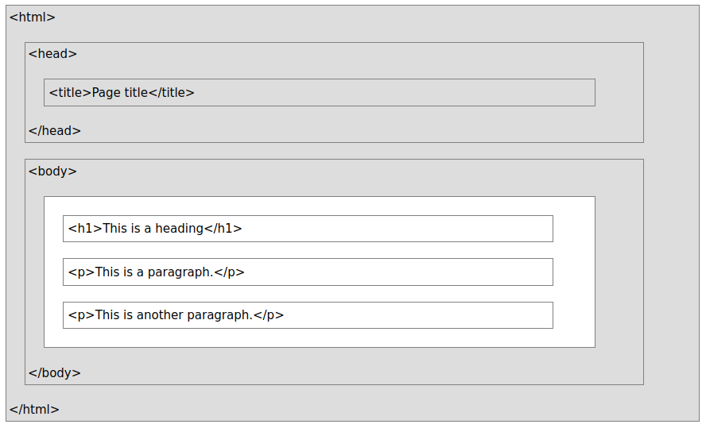

# Module 9.1 - Turtle graphics

[YouTube - Computer Science - Drawing with Turtle part 1 (7:03)](https://www.youtube.com/watch?v=K5VHaqT8s_o)

```python
myscreen = turtle.Screen()
myscreen.exitonclick()
```

How can we calculate the amount we need to turn?

* 1 revolution = 360 degrees
* for a triangle, we accomplish this in 3 turns, 360/3 = 120
* for a square, it takes 4 turns, 360/4 = 90
* For a pentagon, there are 5 turns. What angle would we turn each time?
* How about a 5-pointed star?
* Create a 13-pointed star
* Would this work for a 6-pointed star?

Let's start drawing from a lower position

```python
turtle.goto(0, -300)
```

But it draws while it's traveling, so use `turtle.penup()` and `turtle.pendown()`

Play around drawing a grid of shapes (nested for loops)


[YouTube - TechCave - The Client Server Model (6:13)](https://www.youtube.com/watch?v=L5BlpPU_muY)

### Web Browser server/client

Demonstration of ad-hoc server: nc -nvlp 8888

Navigate to that system: localhost:8888

You can view the information that is sent, and send a response. Reply with hello world!, then press Ctrl+c to terminate the connection

### Two instances of netcat

You can do it without a web browser, using two instances of netcat, one as the server, one as the client.

Setup the server: nc -nvlp 8888

Call with the client: nc -nv 127.0.0.1 8888

Now type in either one and observe the other

# Module 9.2 - More Turtle graphics


### How to serve the web

Webpages use a language called HTML (HyperText Markup Language) to indicate formatting

Tags are nested together to create a hierarchy, telling the web browser what everything should be.



For more information about HTML, visit https://www.w3schools.com/html/default.asp

These tags are placed in a text file, with an html extension - **Talk about how Windows hides file extensions**, and how to use notepad to manually choose an extension

```html
<html>
    <head>
        <title>My first webpage</title>
    </head>
    <body>
        <h1>Wow</h1>
        <p>
            Creating a static webpage is pretty straightforward!
        </p>
    </body>
</html>
```

Put that text in a file called index.html, then navigate to that directory and fire up Python's build-in web server by typing

```bash
cd location/of/file
python3 -m http.server
```

Now, if someone can reach your computer, it will respond with that page. In your web browser, go to localhost:8000

Index.html is the default name that is served up, but you can change the name

**Be careful** with this, though, because other files could be accessed with this server

localhost:8000/stars.py

localhost:8000/htmlStructure.png

### Using netcat to listen

You can see what is sent by the webclient when it navigates to a webpage

Setup the server: `nc -nvlp 8888`

Navigate to localhost:8888

Lots of information is sent, but all that is really necessary is that first command, called GET

### Using netcat to get a webpage

Fire up your python webserver where your index.html is located: `python3 -m http.server`

Use netcat as the client: `nc -nv 127.0.0.1 8000`

The connection is established, but the web server doesn't know what you want, so type `GET / HTTP/1.1` and hit enter... The webpage is served
